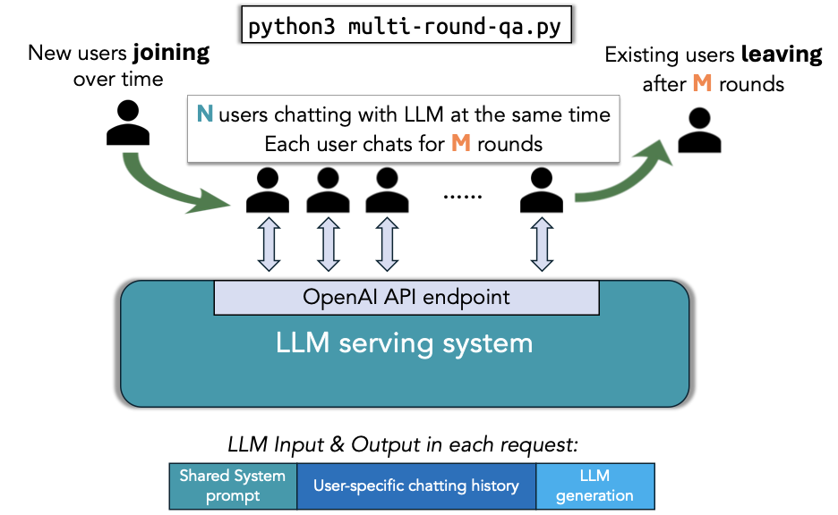

# Benchmarking vLLM Production Stack Performance with multi-round QA

## Overview

This repository contains benchmarking tools for evaluating vLLM Production Stack's performance (e.g., latency, throughput). The initial focus of this benchmark is on the multi-round QA (Question Answering) use case. The script `multi-round-qa.py` simulates multiple users interacting with a language model concurrently for multiple rounds, allowing you to analyze the serving engine's throughput and latency.

The overall workflow of this script is shown below 

## Setup

Installing the required packages needed to run the benchmark by:

```bash
pip install -r requirements.txt
```

### ShareGPT Datasets

Download and prepare the ShareGPT dataset. You need to specify the model type so the script knows how to count tokens.

```bash
wget https://huggingface.co/datasets/anon8231489123/ShareGPT_Vicuna_unfiltered/resolve/main/ShareGPT_V3_unfiltered_cleaned_split.json
python3 cleanup_sharegpt.py --model meta-llama/Llama-3.1-8B-Instruct --share_gpt_path ShareGPT_V3_unfiltered_cleaned_split.json
mv ShareGPT_V3_unfiltered_cleaned_split.json ShareGPT.json
```

## Running benchmarks

To run the multi-round QA benchmark, use the following example command:

```bash
python3 multi-round-qa.py \
    --user-lag 10 \
    --num-rounds 10 \
    --qps 0.5 \
    --shared-system-prompt 1000 \
    --user-history-prompt 2000 \
    --max-input-len 4000 \
    --max-output-len 100 \
    --ignore_eos \
    --model meta-llama/Llama-3.1-8B-Instruct \
    --base-url http://localhost:30080/v1
```

or for sharegpt:

```bash
python3 multi-round-qa.py \
    --user-lag 10 \
    --num-rounds 10 \
    --qps 0.5 \
    --sharegpt \
    --max-input-len 4096 \
    --max-output-len 4096 \
    --ignore_eos \
    --model meta-llama/Llama-3.1-8B-Instruct \
    --base-url http://localhost:30080/v1
```

Use ctrl-C to terminate the benchmark at any time, and the script will write each request's detailed stats to `summary.csv`.

Note: the above command requires there is a serving engine with the `meta-llama/Llama-3.1-8B-Instruct` model served locally at ``http://localhost:30080/v1``. Here's an example command to launch the serving engine with vLLM Production Stack:

### Explanation of the arguments

#### Configuring the workload

- `--user-lag <float>`: How much each user will wait after LLM response before launching next request.
- `--num-rounds <int>`: The number of rounds per user (M in the above figure).
- `--qps <float>`: The overall queries per second (QPS) rate for the system.
- `--shared-system-prompt <int>`: Length of the system prompt shared across all users (in tokens).
- `--user-history-prompt <int>`: Length of the user-specific context (simulating existing chat history) (in tokens).
- `--max-input-len <int>`: Maximum length of the prompt expected (in tokens).
- `--max-output-len <int>`: Maximum length of the answer expected (in tokens).
- `--init-user-id <int>`: The initial user ID to start the benchmark (default = 0). This is useful when you want to resume the benchmark from a specific user ID or avoid serving engine caching the request from previous runs.
- `--sharegpt`: If this option is present, the script will use ShareGPT workload instead of dummy context.
- `--ignore-eos`: If this option is present, the script will force responses to be exactly max-output-len, or minimum of max-output-len and sharegpt response length.

#### Configuring the serving engine connection

- `--model <str>`: The model name (e.g., `mistralai/Mistral-7B-Instruct-v0.2`).
- `--base-url <str>`: The URL endpoint for the language model server.

#### Configuring the experiment

- `--output <str>`: The csv file to dump the detailed stats for each query (default = summary.csv)
- `--log-interval <float>`: Time between each performance summary log in seconds (default = 30)
- `--time <float>`: Total time to run the experiment (default = forever)

#### Processing previous outputs only

- `--process-summary <filename>`: if this option is present, the script will only process the existing output csv and print out the summary without running any experiment.

## Benchmark Metrics

- **Queries Per Second (QPS)**: The average number of queries processed by the model per second.
- **Average Prompt Throughput**: Tokens generated in the prompt per second.
- **Average Generation Throughput**: Tokens generated as part of the response per second.
- **Average TTFT (Time to First Token)**: Average time taken for the model to generate the first token of a response.